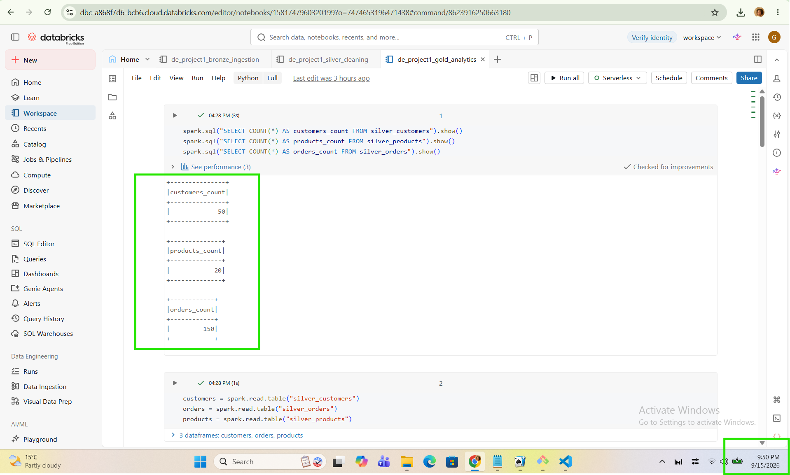
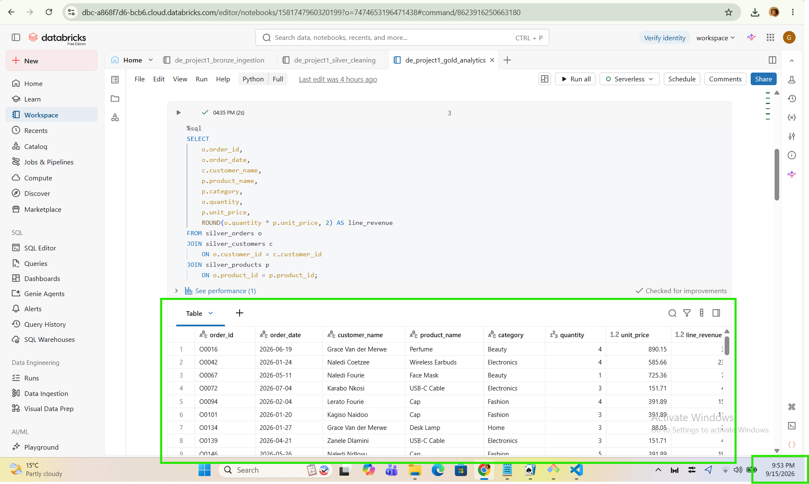
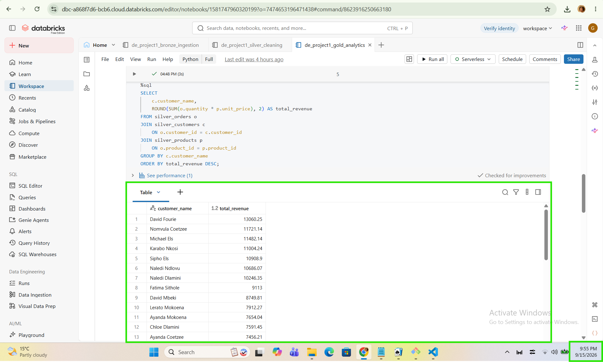
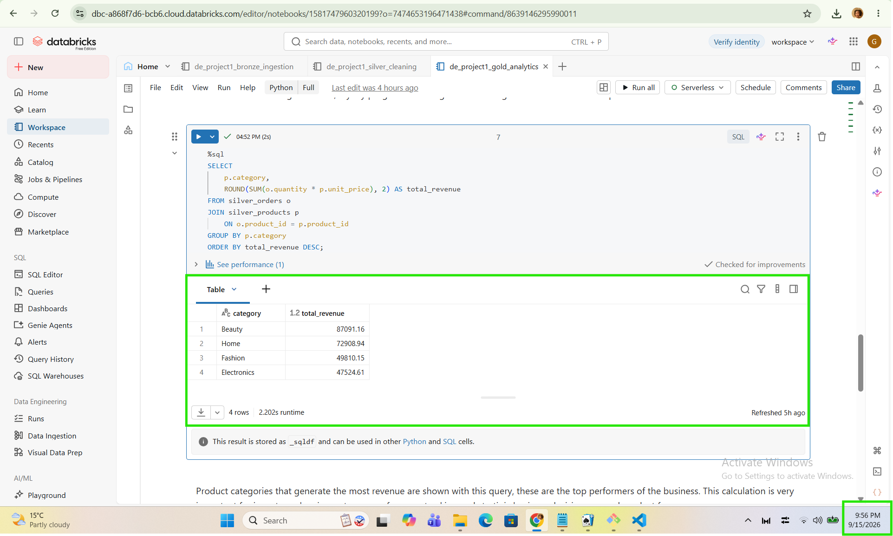
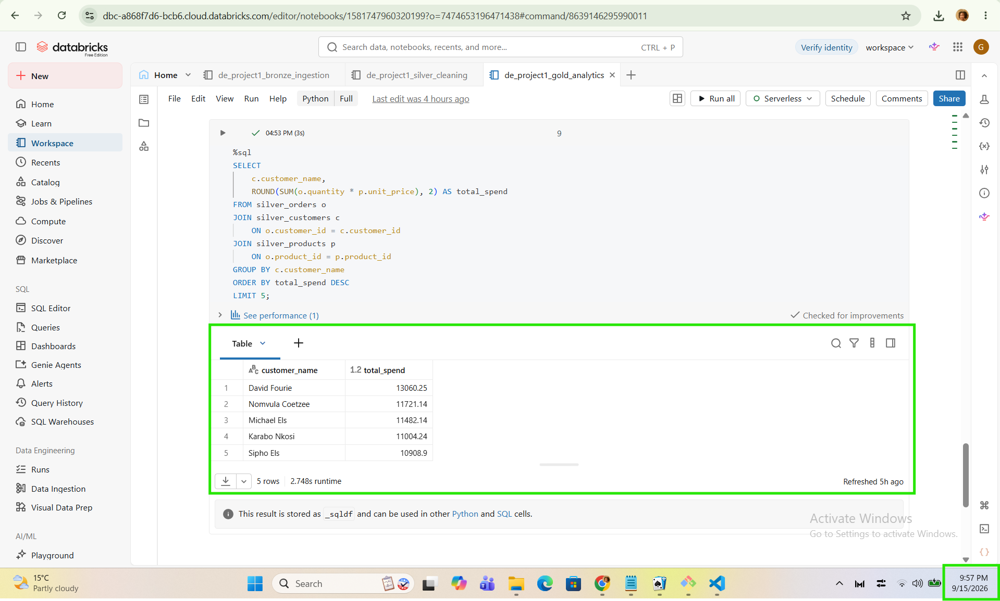

# Kasi Mart — Retail Analytics Pipeline (Databricks / PySpark)

A end-to-end batch data pipeline built on Databricks that ingests raw retail CSVs, cleans and conforms them, and produces business-ready revenue analytics. The project follows the **medallion architecture** (Bronze → Silver → Gold), with each layer implemented as its own notebook.

**Stack:** Databricks (Serverless compute) · PySpark · Spark SQL · Delta tables · Python (pandas, requests)

---

## Data model

Two dimensions and one fact table, joined on surrogate business keys.

```
CUSTOMERS ||--o{ ORDERS }o--|| PRODUCTS
```

| Table | Rows | Columns | Role |
|---|---|---|---|
| `customers` | 50 | customer_id, customer_name, email, province, signup_date | Dimension |
| `products` | 20 | product_id, product_name, category, unit_price | Dimension |
| `orders` | 150 | order_id, customer_id, product_id, order_date, quantity | Fact |

`orders.customer_id` → `customers.customer_id`, `orders.product_id` → `products.product_id`. Revenue is not stored anywhere in the source data — it is derived at query time as `quantity × unit_price`, which is why the Gold layer exists.

---

## Pipeline

### Bronze — raw ingestion (`bronze.py`)

Pulls the three source CSVs straight from GitHub over HTTP, reads them into pandas, converts to Spark DataFrames, and persists them as managed tables with no transformation applied. The Bronze layer is deliberately a faithful copy of the source: if a downstream assumption turns out to be wrong, the raw data is still there to re-derive from.

```python
customers_df.write.mode("overwrite").saveAsTable("bronze_customers")
orders_df.write.mode("overwrite").saveAsTable("bronze_orders")
products_df.write.mode("overwrite").saveAsTable("bronze_products")
```

### Silver — cleaning and typing (`silver.py`)

Applies data quality rules and enforces correct types rather than letting everything default to string:

- `dropDuplicates()` on all three tables to guard against repeated ingestion
- `dropna()` on the keys that must exist — `customer_id`, `product_id`, `order_id`
- `unit_price` cast to `double`, `quantity` cast to `int` so arithmetic is numeric, not lexical
- `signup_date` and `order_date` parsed to real `DATE` types via `to_date(..., "yyyy-MM-dd")`

Casting `quantity` and `unit_price` correctly is what makes the Gold layer's revenue maths trustworthy — multiplying two strings would either fail or silently coerce.

### Gold — analytics (`gold.py`)

Row-count validation followed by four Spark SQL queries that answer the business questions. All four join the fact table back to both dimensions so results are labelled with human-readable names rather than IDs.

---

## Load verification

Before trusting any downstream number, each Silver table is counted against the expected row counts from the source files.

```python
spark.sql("SELECT COUNT(*) AS customers_count FROM silver_customers").show()
spark.sql("SELECT COUNT(*) AS products_count  FROM silver_products").show()
spark.sql("SELECT COUNT(*) AS orders_count    FROM silver_orders").show()
```



**50 / 20 / 150 — exactly matching the source CSVs.** This confirms the deduplication and null-key filtering in Silver removed nothing, meaning the raw extract was already clean on those dimensions and no rows were lost in transit.

---

## Query 1 — Transactional fact view with line revenue

```sql
SELECT
    o.order_id,
    o.order_date,
    c.customer_name,
    p.product_name,
    p.category,
    o.quantity,
    p.unit_price,
    ROUND(o.quantity * p.unit_price, 2) AS line_revenue
FROM silver_orders o
JOIN silver_customers c ON o.customer_id = c.customer_id
JOIN silver_products  p ON o.product_id  = p.product_id;
```



This is the denormalised grain of the whole model: one row per order line, with the customer and product dimensions resolved and a `line_revenue` column calculated as `quantity × unit_price`. On its own, `silver_orders` only knows that order O0016 was 4 units of some product ID — it carries no price and no name. The join restores that context, and the derived column turns a count of units into a monetary value. Every other query in this project is an aggregation over this view, so getting the join keys and the arithmetic right here determines whether the rest of the numbers are correct. It also doubles as the audit trail: if a revenue total looks wrong, this is the table you drill into to find the offending line.

---

## Query 2 — Total revenue per customer

```sql
SELECT
    c.customer_name,
    ROUND(SUM(o.quantity * p.unit_price), 2) AS total_revenue
FROM silver_orders o
JOIN silver_customers c ON o.customer_id = c.customer_id
JOIN silver_products  p ON o.product_id  = p.product_id
GROUP BY c.customer_name
ORDER BY total_revenue DESC;
```



Collapsing the order-line grain up to the customer grain gives lifetime spend per person. David Fourie leads at **R13,060.25**, followed by Nomvula Coetzee (R11,721.14) and Michael Els (R11,482.14). What's notable is how gently the curve falls off — the gap between first and thirteenth place is roughly 1.75×, so revenue here is spread fairly evenly rather than concentrated in a handful of whales. That distribution shape is the actual finding, and it changes what you'd do with it: with no dominant top accounts, broad retention and repeat-purchase programmes will move the needle more than bespoke key-account management. This aggregate is also the input to any RFM or customer-segmentation model built on top of the Gold layer.

---

## Query 3 — Total revenue per product category

```sql
SELECT
    p.category,
    ROUND(SUM(o.quantity * p.unit_price), 2) AS total_revenue
FROM silver_orders o
JOIN silver_products p ON o.product_id = p.product_id
GROUP BY p.category
ORDER BY total_revenue DESC;
```



Aggregating along the product dimension instead of the customer dimension shows where the money actually comes from: **Beauty R87,091.16, Home R72,908.94, Fashion R49,810.15, Electronics R47,524.61** — roughly R257k in total. Beauty alone accounts for about a third of revenue and out-earns Electronics by nearly 2×, despite Electronics items like the Wireless Earbuds (R585.66) carrying higher unit prices than several Beauty lines. That tells you the ranking is being driven by volume and repeat purchasing, not by ticket size, which is exactly the kind of thing unit-level data hides and aggregation reveals. Practically, this drives stock allocation, shelf space and marketing budget: Beauty is the category to protect, and Electronics is the one to investigate before adding more inventory to it. Note this query only needs one join — customers are irrelevant to the question, so they're left out.

---

## Query 4 — Top 5 customers by total spend

```sql
SELECT
    c.customer_name,
    ROUND(SUM(o.quantity * p.unit_price), 2) AS total_spend
FROM silver_orders o
JOIN silver_customers c ON o.customer_id = c.customer_id
JOIN silver_products  p ON o.product_id  = p.product_id
GROUP BY c.customer_name
ORDER BY total_spend DESC
LIMIT 5;
```



The same aggregation as Query 2, truncated to the head of the distribution to produce a ranked shortlist: **David Fourie (R13,060.25), Nomvula Coetzee (R11,721.14), Michael Els (R11,482.14), Karabo Nkosi (R11,004.24) and Sipho Els (R10,908.90)**. Together these five account for roughly R58.2k, about 23% of total revenue from 10% of the customer base — meaningful concentration, but nowhere near a Pareto split, which corroborates the flat-ish curve seen in Query 2. The value of materialising this as its own query is operational: it's a list short enough to act on directly for a VIP tier or account outreach, and because it's computed rather than hand-maintained, it stays correct as new orders land. The top four are separated by under R2,100, so this ranking is volatile and worth refreshing frequently rather than treating as a fixed tier.

---

## Repository structure

```
├── bronze.py     # Raw CSV ingestion → bronze_* tables
├── silver.py     # Deduplication, null handling, type casting → silver_* tables
├── gold.py       # Validation counts + four analytical queries
├── queries.sql   # The four Gold-layer queries, standalone
└── images/       # Execution screenshots
```

## What this project demonstrates

- Medallion architecture with clear separation of raw, conformed and curated layers
- Programmatic ingestion from a remote source rather than manual upload
- Explicit schema enforcement and type casting instead of defaulting to strings
- Data quality gates (deduplication, null-key filtering) applied before analytics
- Row-count reconciliation against source as a load-verification step
- Multi-table joins, aggregations and derived metrics in Spark SQL
- Interpreting results back into business recommendations, not just producing tables
